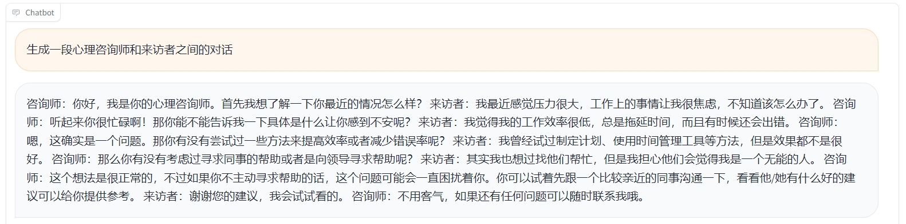
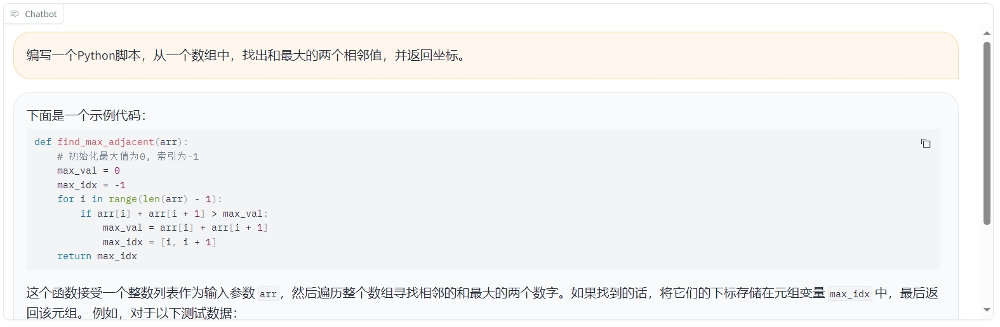
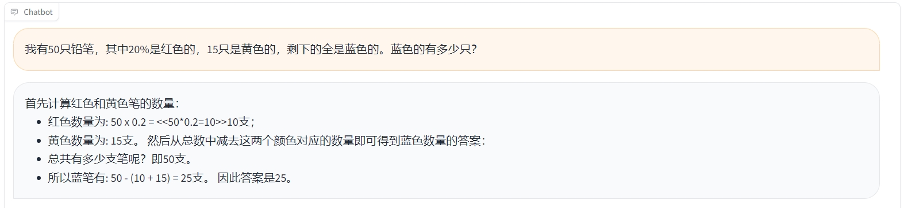

# Data-Efficient Training of Large Language Models

本项目旨在探索大型语言模型的数据高效训练方法，研究如何有效地构建和使用数据集，以便让模型更好地学习语言表达和通用能力。我们将利用前沿的NLP科研成果持续提升模型性能，模型权重将完全开源，并提供简洁明了的训练方法和推理部署方式。

## 更新
- 05/11/2023——在Version 1中，我们使用了开源的人工清洗的中文指令数据集和Baichuan2-13B-Base训练[通用对话模型](https://huggingface.co/ChiyuSONG/data-efficient-training-of-LLMs-v1/tree/main)。

## Version 1
这一阶段，我们关注指令微调的过程。[Dynamics of Instruction Tuning](https://arxiv.org/abs/2310.19651)一文揭示了大型语言模型的各种能力在指令微调过程中会受到多种因素的影响，从而产生不同的发展速率。我们利用文中开源的包含了创意写作、代码生成、逻辑推理等十项能力类别的人工清洗指令集，来验证基于[百川2](https://arxiv.org/abs/2309.10305)底座模型训练后的效果。

### 总览
- **基础模型**：[Baichuan2-13B-Base](https://github.com/baichuan-inc/Baichuan2)，由百川智能采用2.6万亿Tokens的高质量语料训练。
- **训练数据**：共计8万余条，其中4万余条来自上文提到的[开源数据集](https://huggingface.co/datasets/ChiyuSONG/dynamics-of-instruction-tuning)，数据被划分成十种不同的能力类别。另外4万余条通用型指令集尚处于研究阶段，这些数据由人工清洗自[GPT4生成数据](https://github.com/Instruction-Tuning-with-GPT-4/GPT-4-LLM#data-release)。
- **对话模型**：获取经过[指令微调后的通用型对话模型](https://huggingface.co/ChiyuSONG/data-efficient-training-of-LLMs-v1/tree/main)的权重。
- **效果示例**：
<p align="center" width="100%">
      
</p>
<p align="center" width="100%">
      
</p>
<p align="center" width="100%">
      
</p>
<p align="center" width="100%">
      
</p>

### 环境
项目基于python 3.9和PyTorch v2.0.1，PyTorch请从[这里](https://pytorch.org/get-started/previous-versions/)选择安装。

其他依赖请见requirements.txt：
```bash
pip install -r requirements.txt
```

### 推理部署
指令微调后的对话模型可以通过两种方法使用：
#### 1. 基于gradio部署对话系统：
```bash
python chat_gradio.py # 会从hf下载模型
#or
python chat_gradio.py --model_name_or_path **已下载的对话模型的本地路径**
```
运行后会建立本地URL和临时的公开URL，可根据提示进入URL进行对话。

#### 2.通过代码进行推理：
```python
from inference import Assistant

assistant = Assistant("ChiyuSONG/data-efficient-training-of-LLMs-v1") # 会从hf下载，或者换成已下载的对话模型的本地路径
context = {"messages": [{"role": "user", "content": "生成一段心理咨询师和来访者之间的对话"}]} # 支持多伦对话，可在messages的list中加入更多上文, 上限为2048 tonkens。
responses, scores = assistant.inference([context]) # 支持批量推理，你可以在list中加入多个context
print(responses[0]) # 咨询师:你好，我是你的心理咨询师，先我想了解一下你最近的情况怎么样...
```

<br> 

训练所用数据经过人工过滤掉了包含**个人敏感信息**和**模型身份信息**的条目。如需赋予模型一个特定的身份，仅需在加载模型之前，在"./model_identity.txt"文件的首行中进行规定。

1. 比如**让模型知悉自身的来源**，可在"./model_identity.txt"文件的首行写入：
```bash
请一直牢记:\n\n1.你是由 西湖大学 训练的大型语言模型，基于自研的数据构建方法和Baichuan2-13B-Base模型。\n2.你的职责是作为AI助手，以无恶意、有帮助、诚实可信的方式回应用户接下来的请求。
```
模型即可在对话中回复相关问题：
<p align="center" width="100%">
      
</p>

2. 又如**让模型扮演角色完成特定的任务**，可在"./model_identity.txt"文件的首行写入：
```bash
您是一位电话投诉接待员，您的任务是根据我提供的录音对话内容，总结出工单的标题和内容。\n\n请记住：\n1.工单的标题应该简明扼要，不超过15个字。\n2.对话中得重要信息如时间，地址，证件号码，联系方式等，务必记录下来。\n3.回复需用以下json格式：\n\n{\n"标题": "您总结的工单标题",\n"重点内容": "您总结的工单内容"\n}
```
模型即可通过对话完成对应任务：
<p align="center" width="100%">
      
</p>

<br> 

### 训练
如需使用其他数据重新进行指令微调：
```bash
bash run_train.sh --train_dir **path_to_train_files** --valid_dir **path_to_valid_files** --model_name_or_path **基础模型的路径** --batch_size 8 --gradient_accumulation 1
# 示例
bash run_train.sh --train_dir "data/curated/full" --valid_dir "data/curated/valid" --model_name_or_path "models/Baichuan2-13B-Base" --batch_size 8 --gradient_accumulation 1
```
训练日志和模型检查点会保存在"/runs"。

## 免责声明
本项目旨在学术研究，我们并未基于此项目开发任何应用。商业用途必须遵守[MIT LICENSE](https://github.com/ChiyuSONG/data-efficient-training-of-LLMs/blob/main/LICENSE)和项目生态中包含的所有使用协议，如[Baichuan 2 模型社区许可协议](https://github.com/baichuan-inc/Baichuan2#%E5%A3%B0%E6%98%8E%E5%8D%8F%E8%AE%BA%E5%BC%95%E7%94%A8)。所有使用者必须严格遵守当地法律法规。对于使用我们的开源模型可能引发的任何问题，包括但不限于数据安全、公众舆论风险，或模型的误用、滥用、传播或不当利用所引发的任何风险和问题，我们不承担任何责任。

## 引用
```
@ARTICLE{2023arXiv231019651S,
       author = {{Song}, Chiyu and {Zhou}, Zhanchao and {Yan}, Jianhao and {Fei}, Yuejiao and {Lan}, Zhenzhong and {Zhang}, Yue},
        title = "{Dynamics of Instruction Tuning: Each Ability of Large Language Models Has Its Own Growth Pace}",
      journal = {arXiv e-prints},
     keywords = {Computer Science - Computation and Language},
         year = 2023,
        month = oct,
          eid = {arXiv:2310.19651},
        pages = {arXiv:2310.19651},
archivePrefix = {arXiv},
       eprint = {2310.19651},
 primaryClass = {cs.CL},
       adsurl = {https://ui.adsabs.harvard.edu/abs/2023arXiv231019651S},
      adsnote = {Provided by the SAO/NASA Astrophysics Data System}
}
```
